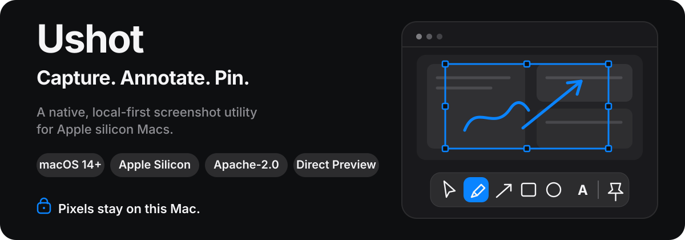
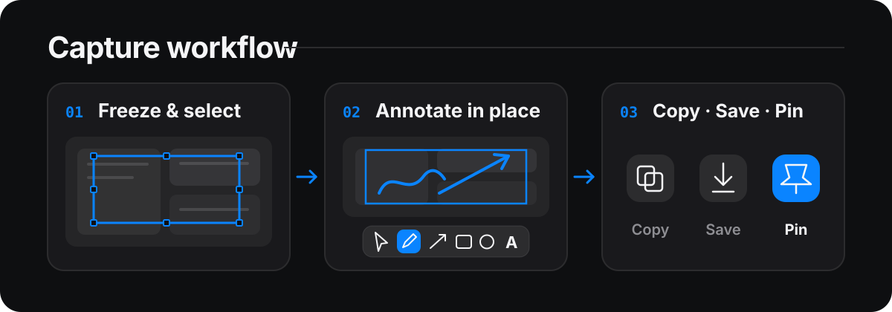

<p align="right">
  <strong>English</strong> · <a href="./README.zh-CN.md">简体中文</a>
</p>

<h1 align="center">
  
</h1>

<p align="center">
  <a href="#one-capture-one-continuous-workflow">Workflow</a> ·
  <a href="#what-ushot-does">Features</a> ·
  <a href="#try-ushot-from-source">Try from source</a> ·
  <a href="#privacy-by-design">Privacy</a> ·
  <a href="#release-status-and-installation">Release status</a>
</p>

Ushot is a native screenshot and annotation utility for Apple silicon Macs running macOS 14 or later. Capture a region, window, or display; mark it up while keeping annotations editable; then copy, save, or keep it pinned across Spaces and full-screen apps.

Screenshot pixels, annotations, clipboard exports, color samples, history, and encoded files are processed locally. Ushot has no account, telemetry, analytics, advertising SDK, crash-report upload, or system-profile submission.

> [!IMPORTANT]
> Ushot 0.1.0 is being prepared as a direct-download preview. Once published, install it only from the official GitHub Release; the signed production appcast remains intentionally absent.

## One capture, one continuous workflow

<p align="center">
  
</p>

Region capture keeps the frozen desktop visible from selection through confirmation. Adjust any edge, annotate directly inside the selected frame, and choose the output you need—without detouring through a cropped screenshot preview.

## What Ushot does

- **Capture precisely.** Capture a region, window, current display, selected display, or every display. Region mode freezes participating displays, snaps to the topmost eligible application window, optionally refines to useful controls with Accessibility permission, and preserves native backing pixels across mixed-scale displays.
- **Annotate without flattening.** Use shapes, lines, paper-plane arrows, freehand, text, counters, highlight, mosaic, blur, Spotlight, layers, and undo/redo. Start in the quick toolbar and continue in the full Canvas Editor with the same editable document.
- **Keep a capture within reach.** Pin a movable, proportionally resizable screenshot that stays visible across Spaces and over full-screen apps. Pinned images begin read-only; show the toolbar only when you want to edit.
- **Inspect colors and dimensions.** Sample colors across displays with managed sRGB, Display P3, Generic RGB, and Adobe RGB (1998) output, or measure in logical points and physical pixels with the screen ruler.
- **Keep local history on your terms.** Editable history is optional, off by default, and stored as inspectable PNG and versioned JSON records. Export PNG, JPEG, or TIFF with optional source-profile preservation.

Implementation detail and current validation evidence live in [STATUS.md](STATUS.md) and [the architecture guide](docs/ARCHITECTURE.md), keeping this page focused on the product workflow.

## Try Ushot from source

You need:

- An Apple silicon Mac running macOS 14 or later.
- A full Xcode installation. Command Line Tools alone can run the SwiftPM checks, but cannot build the `.app` with `xcodebuild`.

Open the project and run the `ScreenshotApp` scheme:

```bash
open ScreenshotApp.xcodeproj
```

Grant Screen Recording permission when macOS asks, press `⌃⌥A`, select a region, add a mark, and choose **Copy**, **Save**, or **Pin**.

### Default global shortcuts

| Action | Shortcut |
| --- | :---: |
| Capture Region | `⌃⌥A` |
| Capture Window | `⌃⌥W` |
| Capture Current Display | `⌃⌥F` |
| Capture Selected Display | `⌃⌥D` |
| Capture All Displays | `⌃⌥M` |
| Color Picker | `⌃⌥C` |
| Screen Ruler | `⌃⌥R` |

Global shortcuts are configurable, and F1–F20 can be assigned without an additional modifier. Annotation-tool shortcuts are configurable separately and apply only while editing a screenshot.

## Privacy by design

- **Screen Recording is required** for capture, color sampling, and other pixel access. Pixels are read only after an explicit user action and are processed on the Mac.
- **Accessibility is optional.** It refines smart region snapping from an application window to a useful control. Ordinary capture and window-level snapping continue to work when permission is absent, denied, or revoked.
- **History is opt-in.** Disabling history stops new records; it does not silently delete existing ones.
- **Network access is user-initiated.** The only normal network entry is **Check for Updates…**. Those HTTPS requests expose ordinary connection metadata to GitHub Pages and GitHub Releases, but Ushot adds no screenshot, annotation, clipboard, history, advertising identifier, or system profile.

Read [PRIVACY.md](PRIVACY.md) for the complete data, permission, persistence, and network boundary.

## Release status and installation

Ushot 0.1.0 is being prepared as a direct-download preview. The protected workflow is configured to build, validate, publish, then anonymously re-download and verify its DMG, ZIP, dSYM ZIP, release manifest, and checksums without activating the production updater. Builds taken directly from `main` remain development artifacts rather than a supported distribution channel.

When an official release is published, download `Ushot-<version>-arm64.dmg` only from the official [Ushot Releases](https://github.com/isCheneycc/ushot/releases) page. The initial public artifact is intentionally ad-hoc signed, has no Developer ID signature or Apple notarization, and is not sandboxed.

1. Open the DMG and drag `Ushot.app` into **Applications**.
2. Remove only the downloaded-file quarantine attribute, then open Ushot:

   ```bash
   xattr -dr com.apple.quarantine "/Applications/Ushot.app"
   open "/Applications/Ushot.app"
   ```

Use this procedure only for `Ushot-<version>-arm64.dmg` downloaded from the official [Ushot Releases](https://github.com/isCheneycc/ushot/releases) page. Do not replace it with `xattr -cr`, do not run it against a broader directory, and do not apply it to third-party downloads. A later install or update may require Screen Recording or Accessibility permission to be granted again.

The app bundle includes the applicable [third-party license notices](UshotApp/Resources/ThirdPartyNotices.txt), including Sparkle and its bundled components.

## Updates and trust

Update checks are manual only. Ushot does not check at launch or on a schedule, download automatically, or submit a system profile.

When the 0.1.0 direct-download preview is published, **Check for Updates…** will remain visible, but the production feed will be intentionally unavailable, so choosing it will report a visible failure. Until production updater readiness is announced separately, install newer previews from the official Releases page.

- The app is pinned to `https://ischeneycc.github.io/ushot/updates/appcast.xml`; when activated, that endpoint must serve the signed production appcast.
- Restricted-Markdown release notes are embedded in that signed feed, so showing them does not make a detached notes request.
- Accepted archives may come only from the official GitHub Release download path.
- The complete appcast and every archive must independently pass EdDSA verification. HTTPS or a matching checksum is not a substitute.

Production self-update remains blocked until the EdDSA key recovery drill and clean-account old-version → new-version matrix pass and Sparkle's client-side enclosed-version validation gap is closed. Developer ID distribution also remains disabled until archive EdDSA cannot be bypassed by Sparkle's matching-code-signature fallback. A downloadable GitHub Release is not, by itself, evidence that these updater gates passed.

See [SECURITY.md](SECURITY.md), [PRIVACY.md](PRIVACY.md), and [the release guide](docs/RELEASING.md) for the complete trust model and release procedure.

## Build, test, and contribute

The Xcode project and Swift package compile the same implementation. Use focused checks during development and the complete scheme plus manual matrix for release work.

```bash
xcodebuild -project ScreenshotApp.xcodeproj \
  -scheme ScreenshotApp \
  -configuration Debug \
  -destination 'platform=macOS,arch=arm64' \
  test
```

```bash
swift build --configuration debug
scripts/test-clt.sh
```

If an installed `Ushot.app` is already running, quit it before UI tests or give the test build an isolated identity with `APP_BUNDLE_IDENTIFIER=io.github.ischeneycc.ushot.uitests`.

Start with [CONTRIBUTING.md](CONTRIBUTING.md) and complete the relevant checks in [docs/MANUAL_TESTING.md](docs/MANUAL_TESTING.md).

## Project documentation

- [Privacy](PRIVACY.md) — local processing, permissions, persistence, and update-network boundaries.
- [Security](SECURITY.md) — vulnerability reporting and update trust.
- [Current status](STATUS.md) — implementation state, validation evidence, and known gaps.
- [Roadmap](docs/ROADMAP.md) — completed phases and release-readiness work.
- [Contributing](CONTRIBUTING.md) — development workflow and review expectations.
- [Architecture](docs/ARCHITECTURE.md) — module, lifecycle, and failure boundaries.
- [Manual testing](docs/MANUAL_TESTING.md) — required hardware and interaction matrix.
- [Releasing](docs/RELEASING.md) — signing, packaging, validation, and publication sequence.
- [Performance](docs/PERFORMANCE.md) — Instruments scenarios and measurement method.
- [Changelog](CHANGELOG.md) — user-visible changes by release.

## License

Ushot is available under the [Apache License 2.0](LICENSE). Future separately distributed paid modules or services do not revoke or narrow the rights already granted for published source.
