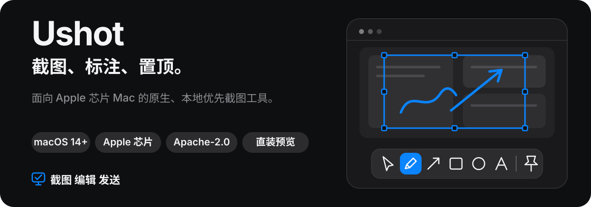
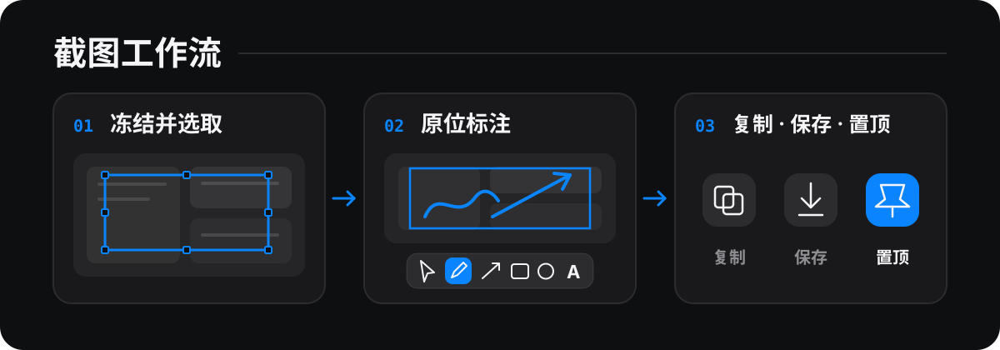

<p align="right">
  <a href="./README.md">English</a> · <strong>简体中文</strong>
</p>

<h1 align="center">
  
</h1>

<p align="center">
  <a href="#一次截图一条连续工作流">工作流</a> ·
  <a href="#ushot-能做什么">功能</a> ·
  <a href="#从源码试用-ushot">从源码试用</a> ·
  <a href="#隐私优先的设计">隐私</a> ·
  <a href="#发布状态与安装">发布状态</a>
</p>

Ushot 是一款面向 macOS 14 及以上版本 Apple 芯片 Mac 的原生截图与标注工具。截取区域、窗口或显示器，在保留标注可编辑性的情况下完成处理，然后复制、保存，或让截图持续悬浮在桌面空间与全屏应用之上。

截图像素、标注、剪贴板输出、颜色采样、历史记录与图像编码均在本机处理。Ushot 不包含账户、遥测、分析、广告 SDK、崩溃报告上传或系统信息提交。

> [!IMPORTANT]
> Ushot 0.1.6（build 7）是当前公开发布版本。请从官方 GitHub Release 安装；已安装 0.1.3、0.1.4 或 0.1.5 的用户也可以通过**检查更新…**从生产 v1 更新源下载并安装 0.1.6。

## 一次截图，一条连续工作流

<p align="center">
  
</p>

区域截图会从选取到确认始终保留冻结桌面。你可以调整任意边缘，直接在选区中标注，再选择所需输出，无需先进入裁剪后的截图预览。

## Ushot 能做什么

- **精准截取。** 截取区域、窗口、当前显示器、指定显示器或全部显示器。区域模式会冻结参与截图的显示器，吸附到最前方可捕获的应用窗口；获得可选的辅助功能权限后，还能细化到适用的界面控件，并在混合缩放显示器间保留原生物理像素。
- **非破坏性标注。** 使用形状、直线、纸飞机式箭头、自由绘制、文本、编号、荧光笔、马赛克、模糊、聚光灯、图层与撤销/重做。可先用快捷工具栏快速标注，再带着同一份可编辑文档进入完整画布编辑器继续处理。
- **让截图持续可见。** 将截图置顶为可移动、等比例缩放的浮动图片，并跨桌面空间与全屏应用保持可见。置顶图片默认只读，仅在需要编辑时显示工具栏。
- **检查色彩与尺寸。** 跨显示器进行色彩管理取色，支持 sRGB、Display P3、Generic RGB 与 Adobe RGB (1998)；也可以使用屏幕标尺测量逻辑点或物理像素。
- **自主管理本地历史。** 可编辑历史记录为可选功能，默认关闭，并保存为可检查的 PNG 与版本化 JSON 文件。可导出 PNG、JPEG 或 TIFF，并选择是否保留来源色彩配置。

实现细节与当前验证证据位于 [STATUS.md](STATUS.md) 和[架构文档](docs/ARCHITECTURE.md)，让此页面专注于产品工作流。

## 从源码试用 Ushot

你需要：

- 运行 macOS 14 或更高版本的 Apple 芯片 Mac。
- 完整的 Xcode。Command Line Tools 可以运行 SwiftPM 检查，但无法通过 `xcodebuild` 构建 `.app`。

打开工程并运行 `ScreenshotApp` scheme：

```bash
open ScreenshotApp.xcodeproj
```

按 macOS 提示授予屏幕录制权限，按下 `⌃⌥A`，选取区域、添加标注，再选择**复制**、**保存**或**置顶**。

### 默认全局快捷键

| 操作 | 快捷键 |
| --- | :---: |
| 截取区域 | `⌃⌥A` |
| 截取窗口 | `⌃⌥W` |
| 截取当前显示器 | `⌃⌥F` |
| 截取指定显示器 | `⌃⌥D` |
| 截取全部显示器 | `⌃⌥M` |
| 取色器 | `⌃⌥C` |
| 屏幕标尺 | `⌃⌥R` |

所有全局快捷键均可配置，并支持将 F1–F20 单独设为快捷键。标注工具快捷键可以独立配置，并且只在编辑截图时生效。

## 隐私优先的设计

- **截图与像素访问需要屏幕录制权限。** 像素仅在用户明确触发操作后读取，并始终在 Mac 本机处理。
- **辅助功能权限是可选的。** 它只会把智能区域吸附从应用窗口细化到稳定的控件层级。截图时可使用 Option-↑/↓ 或按住 Option 滚动来选择父级或子级。权限不存在、被拒绝或撤销时，普通截图与窗口级吸附仍然可用。
- **历史记录由用户主动开启。** 关闭历史记录会停止创建新记录，但不会静默删除已有内容。
- **网络访问由用户主动触发。** 唯一的常规网络入口是**检查更新…**。这些 HTTPS 请求会向 GitHub Pages 与 GitHub Releases 暴露正常的连接元数据，但 Ushot 不会附加截图、标注、剪贴板、历史记录、广告标识符或系统信息。

完整的数据、权限、本地存储和网络边界请阅读 [PRIVACY.md](PRIVACY.md)。

## 发布状态与安装

Ushot 0.1.6（build 7）是当前已发布版本。受保护工作流已发布其不可变五资产 GitHub Release，并扩展了已签名的 v1 appcast。0.1.3、0.1.4 或 0.1.5 用户可手动安装 0.1.6，也可通过**检查更新…**升级。直接从 `main` 构建的版本仍属于开发产物，而不是受支持的分发渠道。

请从不可变的 [Ushot v0.1.6 Release](https://github.com/isCheneycc/ushot/releases/tag/v0.1.6) 下载 [Ushot-0.1.6-arm64.dmg](https://github.com/isCheneycc/ushot/releases/download/v0.1.6/Ushot-0.1.6-arm64.dmg) 并手动安装。公开产物会刻意采用 ad-hoc 签名，不包含 Developer ID 签名或 Apple 公证，并且不会启用 App Sandbox。

1. 打开 DMG，将 `Ushot.app` 拖入**应用程序**。
2. 只移除下载文件的隔离属性，然后打开 Ushot：

   ```bash
   xattr -dr com.apple.quarantine "/Applications/Ushot.app"
   open "/Applications/Ushot.app"
   ```

此流程仅适用于官方 [Ushot Releases](https://github.com/isCheneycc/ushot/releases) 页面实际已发布的 Ushot 版本化 DMG。不要把无版本或第三方下载当作发布证据，不要将命令替换为 `xattr -cr`，也不要对更宽泛的目录执行。后续安装或更新可能需要重新授予屏幕录制或辅助功能权限。

应用包内包含适用的[第三方许可证声明](UshotApp/Resources/ThirdPartyNotices.txt)，其中包括 Sparkle 及其捆绑组件。

## 更新与信任边界

更新检查只能由用户手动触发。Ushot 不会在启动时或定时检查，不会自动下载，也不会提交系统信息。

0.1.1 客户端仍固定使用旧 `/updates/appcast.xml` 端点，该端点将永久保持不可用（HTTP 404）。Ushot 0.1.2 及以后版本指向 v1 更新源。其首个版本是 0.1.4（build 5），当前版本是 0.1.6（build 7）：已安装 0.1.3、0.1.4 或 0.1.5 的客户端可通过**检查更新…**下载并安装 0.1.6。0.1.1 或 0.1.2 安装无法经该路径自更新，应改为从 GitHub 手动安装当前发布版。

- Ushot 0.1.2 及以后版本固定使用 `https://ischeneycc.github.io/ushot/updates/v1/appcast.xml`；旧端点永久保持 HTTP 404。
- 受限 Markdown 格式的发行说明直接嵌入签名更新源，因此显示说明不会发起独立请求。
- 被接受的更新归档只能来自官方 GitHub Release 下载路径。
- 加固运行时会严格比对 appcast 与解压应用的显示版本/构建版本，并要求每个归档通过 EdDSA，即使应用代码签名匹配也不能替代。从 0.1.3 开始，还会在 Sparkle 解析 item 之前校验认证后的原始 XML，拒绝解析后对象可能掩盖的重复、错位、错误命名空间、DTD 与实体输入。完整 appcast 会另行签名；HTTPS 或匹配的校验和不能作为替代。

更新检查仍只能由用户手动触发：不在启动时检查、不定时检查、不自动下载、不提交系统信息。公开发布仍为 ad-hoc 签名的 GitHub Release；当前分发渠道不需要加入 Apple Developer Program。Developer ID 与公证仍属于独立的未来路线。

完整信任模型与发布流程请阅读 [SECURITY.md](SECURITY.md)、[PRIVACY.md](PRIVACY.md) 和[发布指南](docs/RELEASING.md)。

## 构建、测试与贡献

Xcode 工程与 Swift Package 编译同一套实现。开发过程中使用聚焦检查，发布工作前再执行完整 scheme 与人工测试矩阵。

```bash
xcodebuild -project ScreenshotApp.xcodeproj \
  -scheme ScreenshotApp \
  -configuration Debug \
  -destination 'platform=macOS,arch=arm64' \
  test
```

```bash
swift build --configuration debug
scripts/test-clt.sh
```

如果已经有一个安装好的 `Ushot.app` 正在运行，请在 UI 测试前退出它，或使用 `APP_BUNDLE_IDENTIFIER=io.github.ischeneycc.ushot.uitests` 为测试构建提供隔离身份。

请先阅读 [CONTRIBUTING.md](CONTRIBUTING.md)，并完成 [docs/MANUAL_TESTING.md](docs/MANUAL_TESTING.md) 中与改动相关的检查。

## 项目文档

- [隐私](PRIVACY.md) — 本地处理、权限、持久化与更新网络边界。
- [安全](SECURITY.md) — 漏洞报告与更新信任模型。
- [当前状态](STATUS.md) — 实现状态、验证证据与已知缺口。
- [路线图](docs/ROADMAP.md) — 已完成阶段与发布准备工作。
- [贡献指南](CONTRIBUTING.md) — 开发流程与审查要求。
- [架构](docs/ARCHITECTURE.md) — 模块、生命周期与失败边界。
- [人工测试](docs/MANUAL_TESTING.md) — 必需的硬件与交互矩阵。
- [发布指南](docs/RELEASING.md) — 签名、打包、验证与发布顺序。
- [性能](docs/PERFORMANCE.md) — Instruments 场景与测量方法。
- [更新日志](CHANGELOG.md) — 各版本面向用户的变更。

## 许可证

Ushot 采用 [Apache License 2.0](LICENSE)。未来单独分发的付费模块或服务，不会撤销或缩减已发布源码已授予的权利。
